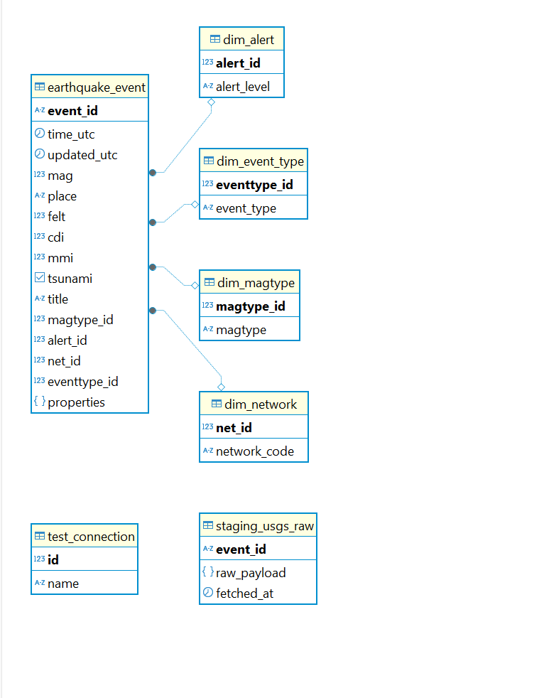

# Projet ETL Séismes USGS

Ce projet met en place une chaîne ETL automatisée pour collecter, stocker et transformer les données publiques de séismes fournies par l’USGS (United States Geological Survey).  
L’objectif est de disposer d’une base de données PostgreSQL structurée pour l’analyse et la visualisation des événements sismiques récents.

---

## Prérequis

- **Python 3.8+**
- **PostgreSQL** installé et accessible
- Dépendances Python :  
  Installe-les avec :
  ```sh
  pip install -r requirements.txt
  ```

---

## Installation et lancement

1. **Cloner le dépôt**
   ```sh
   git clone https://github.com/votre-utilisateur/data_eng_project.git
   cd data_eng_project
   ```

2. **Installer les dépendances**
   ```sh
   pip install -r requirements.txt
   ```

3. **Lancer le pipeline complet**
   ```sh
   python sources/running.py
   ```

Chaque étape peut aussi être lancée séparément :
```sh
python sources/fetch_usgs.py
python sources/load_staging.py
python sources/transform.py
```

---

## Structure du projet

```
data_eng_project/
│
├── data/
│   └── raw_usgs_month.json
│
├── docs/
│   └── schema_postgres.png
│
├── sources/
│   ├── fetch_usgs.py
│   ├── load_staging.py
│   ├── transform.py
│   ├── running.py
│   └── transform.sql
│
├── requirements.txt
└── README.md
```

---

## Schéma du pipeline ETL

```
   +-------------------------------+
   |        fetch_usgs.py          |
   |   (Extract from USGS API)     |
   +---------------+---------------+
                   |
                   v
   +---------------+---------------+
   |     load_staging.py           |
   |   (Load brut dans PostgreSQL) |
   |      table: staging_usgs_raw  |
   +---------------+---------------+
                   |
                   v
   +---------------+---------------+
   |     transform.py              |
   |     transform.sql             |
   |  - Nettoyage & enrichissement |
   |  - Chargement dims & faits    |
   +---------------+---------------+
                   |
                   v
   +-------------------------------+
   |   Tables finales PostgreSQL   |
   |  - dim_magtype                |
   |  - dim_alert                  |
   |  - dim_network                |
   |  - dim_event_type             |
   |  - earthquake_event (fait)    |
   +---------------+---------------+
                   ^
                   |
   +---------------+---------------+
   |   running.py                  |
   | (Orchestration via subprocess |
   |  + Windows Task Scheduler)    |
   +-------------------------------+
```

---

## Schéma de la base de données



## Informations complémentaires

- Les scripts sont orchestrés par `running.py` pour une exécution automatique.
- Le pipeline peut être planifié via le Planificateur de tâches Windows pour une automatisation complète.
- Les données sources sont issues de l’API USGS GeoJSON (séismes du mois en cours).
- Les tables finales sont prêtes pour l’analyse ou la visualisation dans un outil BI.
